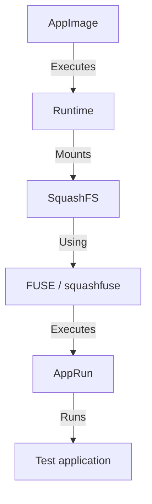

# AppImageRuntimeTests

This repository provides reproducible integration tests for AppImage Type 2 runtimes across multiple Linux architectures (x86_64, i686, aarch64, armv7l). 

The primary purpose is to demonstrate that a compiled AppImage runtime is not merely structurally valid as an ELF binary, but actually functions correctly as an AppImage runtime on the target architecture. This is particularly relevant for verifying the runtimes produced by the Yggdrasil recipe (e.g., [JuliaPackaging/Yggdrasil#14695](https://github.com/JuliaPackaging/Yggdrasil/pull/14695)).

## Why this repository exists

A runtime can be successfully cross-compiled but still fail at execution due to issues with FUSE, squashfuse, or embedded libc (musl/glibc) incompatibilities. Structural validation (like checking the ELF header or running the binary directly to see its help menu) is insufficient to guarantee that an AppImage will actually mount and execute the payload.

This repository tests the full execution path:


## Levels of Testing

To accommodate CI environments where FUSE might not be fully available or reliably supported under QEMU user-mode emulation, the tests are split into two levels:

- **Level 1: Runtime execution:** Verifies that the runtime ELF itself executes correctly for every architecture (e.g. `runtime --appimage-help`). This confirms that the cross-compiled binary runs on the target architecture.
- **Level 2: AppImage integration:** Verifies the complete AppImage execution path, requiring FUSE to mount the SquashFS filesystem and execute the embedded test application.

## CI Matrix and Guarantees

The GitHub Actions workflow tests the following matrix:
- **Architectures:** x86_64, i686, aarch64, armv7l
- **Compression:** gzip, zstd

It guarantees that:
1. A minimal deterministic C application can be compiled for each architecture.
2. The runtime can be attached to a SquashFS image to form an AppImage.
3. The AppImage correctly mounts the payload via FUSE and executes it, passing arguments to the inner application.
4. Zstd support in squashfuse is properly compiled and functional.

### Architecture Support in CI
- **x86_64:** Runs natively on the GitHub Actions Ubuntu runner.
- **i686, aarch64, armv7l:** Uses `qemu-user-static` (via binfmt_misc) installed directly on the GitHub Actions runner. Since we run the binary directly on the host (not inside a restricted container), FUSE operations generally have access to `/dev/fuse` and function correctly under QEMU.

## Testing a Custom Runtime (e.g., Yggdrasil)

To test a runtime from a PR, you can manually trigger the GitHub Actions workflow ("Run workflow") and provide the `RUNTIME_URL`. The workflow will download your custom runtime instead of the default `AppImageKit` type2-runtime.

Alternatively, you can run the tests locally:

```bash
# 1. Compile the test application
./scripts/build_test_app.sh x86_64 test_app_x86_64

# 2. Download or copy your runtime
./scripts/download_runtime.sh x86_64
# Or copy manually: cp /path/to/your/runtime runtime-x86_64

# 3. Build the AppImage (gzip and zstd)
./scripts/build_appimage.sh runtime-x86_64 test_app_x86_64 gzip test_gzip.AppImage
./scripts/build_appimage.sh runtime-x86_64 test_app_x86_64 zstd test_zstd.AppImage

# 4. Test execution
./scripts/test_appimage.sh test_gzip.AppImage x86_64
./scripts/test_appimage.sh test_zstd.AppImage x86_64
```

## Known Limitations

- Running squashfuse through `qemu-user-static` may encounter edge cases with unimplemented FUSE syscalls in QEMU depending on the host QEMU version. If `test_appimage.sh` detects a FUSE mount failure, it falls back to `--appimage-extract-and-run` to prove the binary is structurally valid, but explicitly marks the test as a FUSE failure.
- The test application currently does not perform network access or complex filesystem operations, testing only the structural execution and argument passing of the AppImage runtime.
