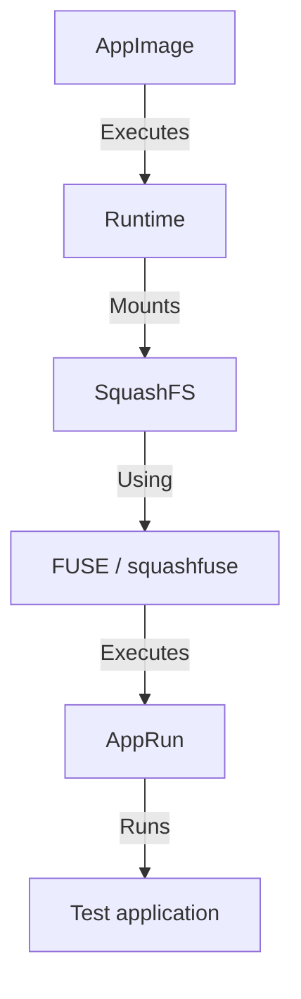

# AppImageRuntimeTests Documentation

Welcome to the AppImageRuntimeTests documentation.

This project validates AppImage Type 2 runtimes on multiple architectures.

## Architecture

```mermaid
flowchart TD
    A[AppImage] -->|Executes| B[Runtime]
    B -->|Mounts| C[SquashFS]
    C -->|Using| D[FUSE / squashfuse]
    D -->|Executes| E[AppRun]
    E -->|Runs| F[Test application]
```
